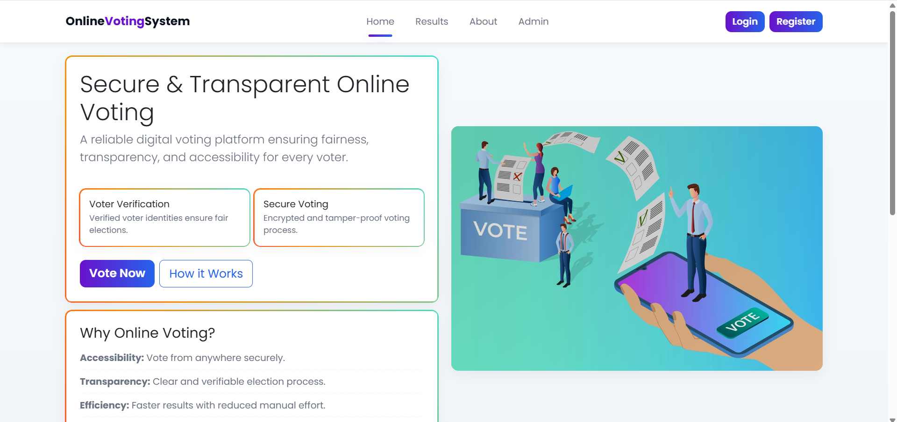
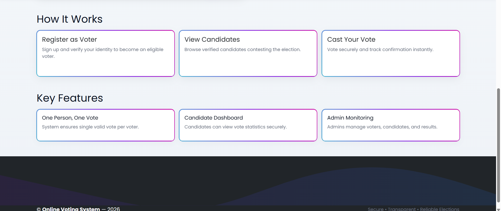
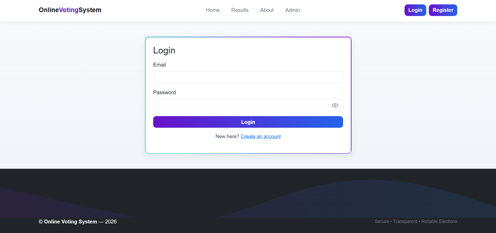
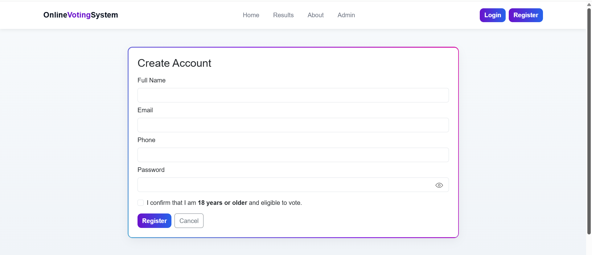
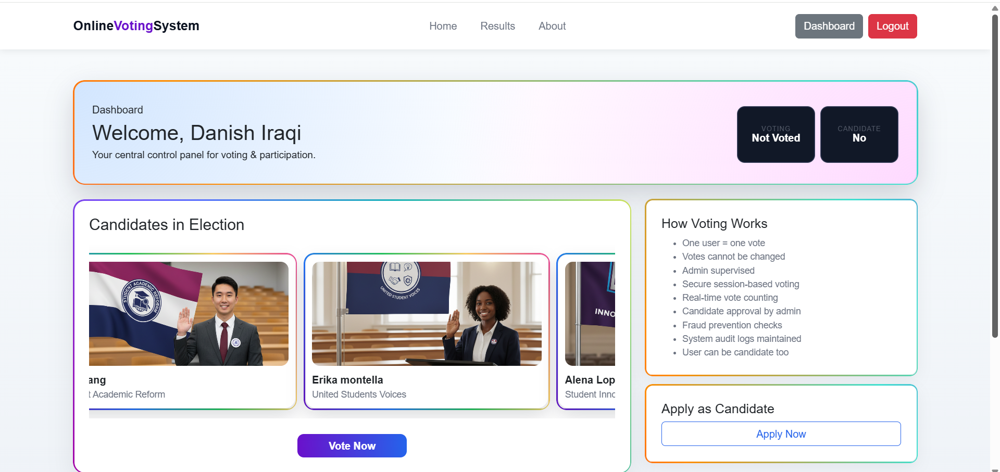
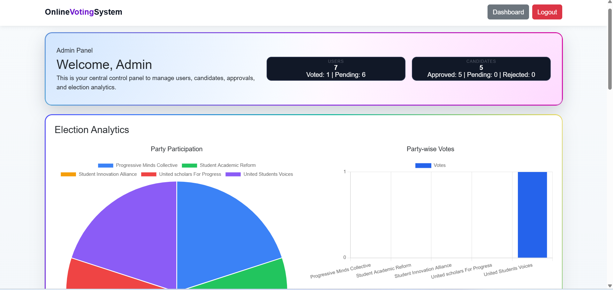
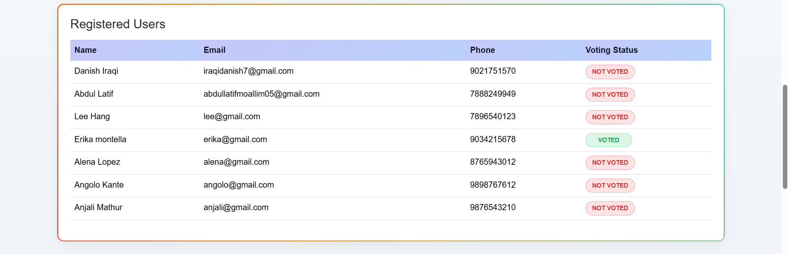
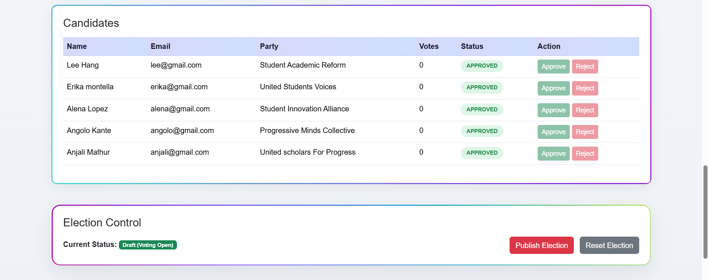
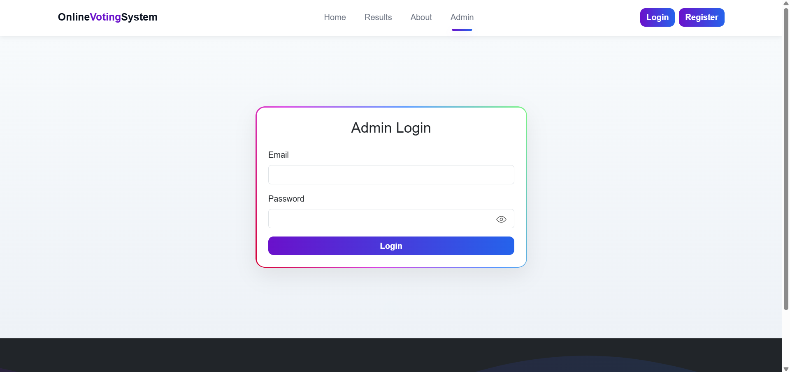
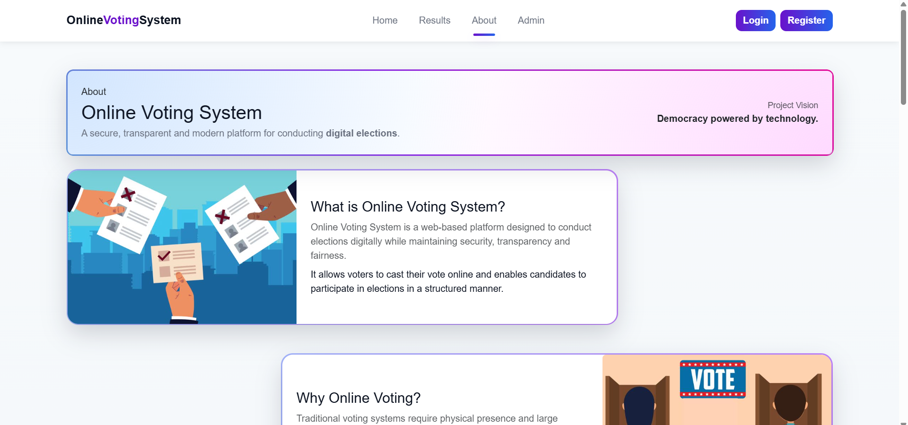

# Online Voting System

A secure web-based voting platform where users can register as voters or candidates, cast votes, and view results with proper authentication and role management.

---

##  Features

- Voter & Candidate Registration  
- Secure Login System  
- One Person One Vote Logic  
- Candidate Dashboard  
- Vote Casting System  
- Live Result Display  
- Session Management & Authentication  

---

##  Technologies Used

- PHP  
- MySQL  
- HTML  
- CSS  
- JavaScript  

---

## 📸 Screenshots

###  Home Page

###  Login & Register

###  User Dashboard

###  Admin Dashboard

### Candidates View

### Admin Login

### About Page

##  Project Structure

- images/ → UI assets  
- PHP files → Voting logic, authentication, dashboards  
- online_voting.sql → Database  

---

##  How to Run

1. Install XAMPP  
2. Start Apache & MySQL  
3. Import online_voting.sql  
4. Run project in browser  

---

##  Future Improvements

- OTP/email verification  
- Admin analytics dashboard  
- UI enhancements
